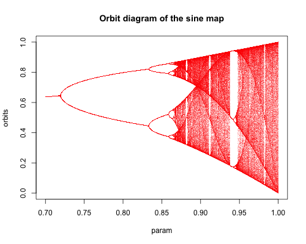

# map1d

Functions to create plots of one-dimensional maps.

# Installation

```R
devtools::install_github("btamasi/map1d")
```

# Examples

## Cobweb plots of the logistic map with r=3.2 and r=3.9

```R
par(mfrow = c(1, 2))
plotCobweb(function(x) mapLogistic(x, 3.2), 0.1, 200)
title("r = 3.2")
plotCobweb(function(x) mapLogistic(x, 3.9), 0.1, 200)
title("r = 3.9")
```


## Orbit diagram of the sine map

```R
plotOrbitDiagram(function(x, r) r * sin(pi * x), 0.7, 1, 800, 800, 500)
title("Orbit diagram of the sine map")
```


# Reference

* Steven H. Strogatz: Nonlinear Dynamics and Chaos: With Applications to Physics, Biology, Chemistry, and Engineering - chapter 10
